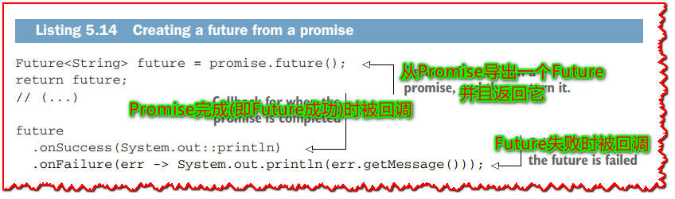
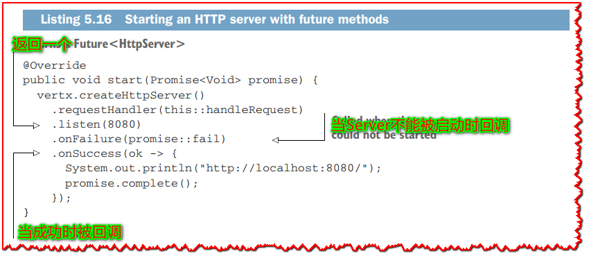
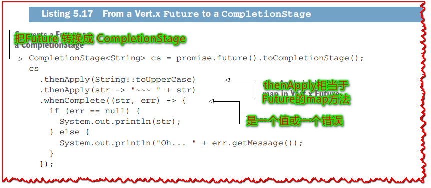
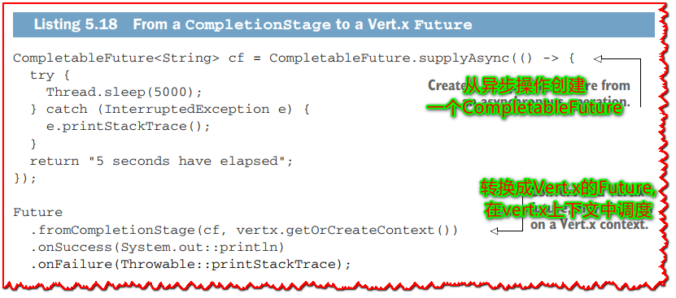
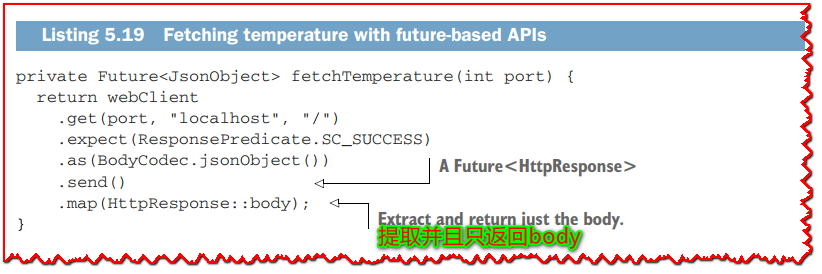
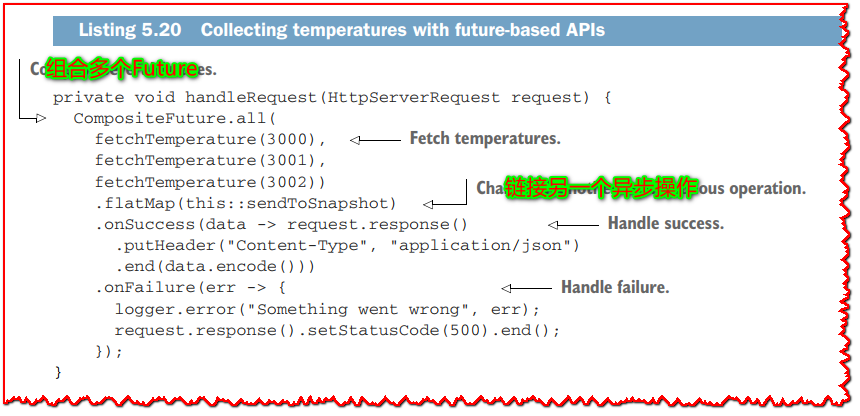
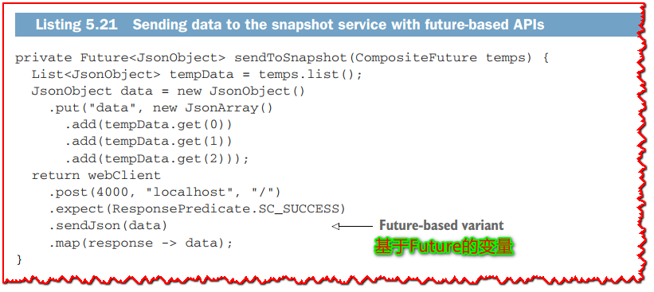

# 5.3 Futures 和 Promises

> 翻译: 白石(https://github.com/wjw465150/Vert.x-Core-Manual)

  由于 Verticle `start` 方法的签名，你已经接触过 Vert.x 的`futures` 和 `promises`。 你可能也接触过其他语言，比如 JavaScript。 我们将进一步探索这个模型，看看它们是如何用 Vert.x 组合异步操作的有趣原语。

  Vert.x 实现了与 Barbara Liskov 和 Liuba Shrira 的原始研究结果一致的 Future 和 Promise 模型。他们引入了 Promise 作为组合异步远程过程调用的语言抽象。

  promise保存了一些现在还没有值的计算的值。承诺最终会带着一个结果值或一个错误完成。在异步I/O上下文中，promise自然适合保存异步操作的结果。反过来，future允许您读取最终将从promise中获得的值。

> **⚠重要:**  总结一下：promise 用于写入最终值，future 用于在可用时读取它。 现在让我们看看它在 Vert.x 中是如何工作的。

## 5.3.1 Vert.x 中的 Futures 和 promises
  Promise 是由一段即将执行异步操作的代码创建的。 例如，假设您要报告异步操作已完成，不是现在，而是在 5 秒内。 在 Vert.x 中，您将为此使用计时器，并使用 promise 来保存结果，如下面的清单所示。

**清单 5.13 创建一个 promise**


```java
Promise<String> promise = Promise.promise();
vertx.setTimer(5000, id -> {
  if (System.currentTimeMillis() % 2L == 0L) {
    promise.complete("Ok!");
  } else {
    promise.fail(new RuntimeException("Bad luck..."));
  }
});

// (...)
```

这里的异步操作是一个五秒的定时器，之后promise就完成了。 根据当前时间是奇数还是偶数，promise 以一个值完成或因异常而失败。 这很好，但我们如何真正从 Promise 中`get`值？

想要在结果可用时做出反应的代码需要一个future对象。一个Vertx future是从一个promise创建的，然后传递给想要读取该值的代码，如下一个清单所示，即清单5.13的其余部分。

**清单 5.14 从一个 Promise 中创建一个future**



```java
Future<String> future = promise.future();
return future;

// (...)

future
  .onSuccess(System.out::println)
  .onFailure(err -> System.out.println(err.getMessage()));
```

`Future` 接口定义了两种方法，`onSuccess` 和 `onFailure`，用于处理值和错误。 当我们运行相应的代码时，我们会看到“Ok！” 或“Bad lucky...”在5秒后打印。

我们可以使用Future执行更高级的异步操作，如下面的清单所示。

**清单 5.15 高级future 组合操作**


```java
promise.future()
  .recover(err -> Future.succeededFuture("Let's say it's ok!"))
  .map(String::toUpperCase)
  .flatMap(str -> {
    Promise<String> next = Promise.promise();
    vertx.setTimer(3000, id -> next.complete(">>> " + str));
    return next.future();
  })
  .onSuccess(System.out::println);
```

当 promise 失败时调用 `recover` 操作，它用于将错误替换为另一个值。 您可以将 `recover` 视为 Java 中的 `catch` 块的等价物，您可以在其中处理错误。 这里，我们只是使用一个成功的future提供一个恢复值，但是在更高级的情况下，当您无法进行恢复时，您也可以使用一个失败的future。

map 操作使用函数转换值，而 `flatMap` 与另一个异步操作组合。 您可以将`flatMap` 视为“然后”。 此处操作获取字符串值并在3秒后将“>>>”添加到其前面。 我们还看到了典型的 Promise/Future 模式，我们首先创建一个 Promise，然后执行一个最终完成 Promise 的异步操作，最后返回一个 Future，这样该值就可以被另一段代码使用。

## 5.3.2 Vert.x 4 中基于Future的 API

Vert.x 4 将 Future与回调一起引入核心 API。 虽然回调仍然是规范模型，但大多数 API 都可以使用返回`Future`的变体。

这意味着给定一个方法，`void doThis(Handler<AsyncResult<T>>)`，有一个形式为`Future<T> doThis()`的变体。 下面的清单显示了一个很好的示例，我们在其中启动了一个 HTTP 服务器。

**清单 5.16 使用Future方法启动 HTTP 服务器**



```java
@Override
public void start(Promise<Void> promise) {
  vertx.createHttpServer()
    .requestHandler(this::handleRequest)
    .listen(8080)
    .onFailure(promise::fail)
    .onSuccess(ok -> {
      System.out.println("http://localhost:8080/");
      promise.complete();
  });
}
```

我们在前面的例子中看到的 listen 方法接受一个回调接口`Handler<AsyncResult<HttpServer>>`，但是在这里它返回一个 `Future<HttpServer>`。 然后，我们可以链接调用 `onFailure` 和 `onSuccess` 来定义服务器启动或发生错误时要做什么。

> **🏷注意:** 您可以从 Vert.x 3.8 开始使用新的 Promise/Future 接口，但基于Future的 API 仅在 Vert.x 4 中可用。

## 5.3.3 与 CompletionStage API 的互操作性

Vert.x futures 还可以与 JDK 中的 `java.util.concurrent` 包的 `CompletionStage` 接口互操作。 `CompletionStage` 接口代表异步操作中的一个步骤，因此您可以将其视为future，尤其是当有一个名为 `CompletableFuture` 的类实现了 `CompletionStage` 时。 例如，Java 11 中的 HTTP 客户端 API 提供了 `sendAsync` 方法，这些方法返回 `CompletableFuture` 来发出异步 HTTP 请求。

当您需要与在 API 中使用`CompletionStage`的库进行交互时，Vert.x 的Future和`CompletionStage`之间的互操作性非常有用。

> **🏷注意:** Vert.x `Future` 接口不是 `CompletionStage` 的子类型。 Vert.x 团队在为 Vert.x 4 准备路线图时考虑了这一点，但我们最终选择了我们自己的接口定义，因为`CompletionStage`与线程模型无关。实际上，以“**async**”为后缀的方法提供了变体，您可以在其中传递执行器，例如 `CompletionStage<Void> thenRunAsync(Runnable,Executor)`，而没有执行器参数的变体默认分派到 `ForkJoinPool` 实例。这些方法可以很容易地跳出 Vert.x 事件循环或工作线程池，因此我们选择提供互操作性，而不是直接在 Vert.x API 中使用 `CompletionStage`。

以下清单显示了我们如何从 Vert.x Future 迁移到 `CompletionStage`。

**清单 5.17 从 Vert.x Future 到 CompletionStage**



```java
CompletionStage<String> cs = promise.future().toCompletionStage();
cs
  .thenApply(String::toUpperCase)
  .thenApply(str -> "~~~ " + str)
  .whenComplete((str, err) -> {
    if (err == null) {
      System.out.println(str);
    } else {
      System.out.println("Oh... " + err.getMessage());
    }
  });
```

这里我们将字符串结果转换为大写，在它前面加上一个字符串，最终调用了*whenComplete*。 请注意，这是一个 *BiConsumer*，需要测试哪些值或异常参数为 *null*，才能知道 promise 是否成功完成。 同样重要的是要注意，除非您调用异步的 *CompletionStage* 方法，否则调用将在 Vert.x 线程上执行。

最后但同样重要的是，您也可以将 *CompletionStage* 转换为 Vert.x `Future`，如下所示。

**清单 5.18 从 CompletionStage 到 Vert.x Future**



```java
CompletableFuture<String> cf = CompletableFuture.supplyAsync(() -> {
  try {
    Thread.sleep(5000);
  } catch (InterruptedException e) {
    e.printStackTrace();
  }
  return "5 seconds have elapsed";
});

Future
  .fromCompletionStage(cf, vertx.getOrCreateContext())
  .onSuccess(System.out::println)
  .onFailure(Throwable::printStackTrace);
```

`CompletableFuture` 实现了 `CompletionStage`接口，而 `supplyAsync` 调度了对默认 `ForkJoinPool` 的调用。 将使用该线程池中的一个线程，在返回一个字符串之前休眠5秒钟，该字符串将是' CompletableFuture '结果。`fromCompletionStage` 方法转换为 Vert.x `Future`。 该方法有两种变体：一种具有 Vert.x 上下文，用于在上下文上调用 `Future` 方法，如`onSuccess`，另一种调用将发生在完成提供的`CompletionStage` 实例的任何线程上。

## 5.3.4 Vert.x Future的收集器服务

回到边缘服务示例，我们可以利用使用 Future 的 Vert.x API。 我们将使用清单 5.16 中较早的 verticle `start` 方法。

首先，我们可以在下面的清单中定义 `fetchTemperature` 方法来从服务中获取温度。

**清单 5.19 使用基于Future的 API 获取温度**



```java
private Future<JsonObject> fetchTemperature(int port) {
  return webClient
    .get(port, "localhost", "/")
    .expect(ResponsePredicate.SC_SUCCESS)
    .as(BodyCodec.jsonObject())
    .send()
    .map(HttpResponse::body);
}
```

该方法返回一个`JsonObject`的future，为了实现这一点，我们使用`WebClient HttpRequest send`方法返回future，然后映射结果以仅提取JSON数据。

在接下来显示的 `handleRequest` 方法中收集温度。

**清单 5.20 使用基于Future的 API 收集温度**



```java
private void handleRequest(HttpServerRequest request) {
  CompositeFuture.all(
    fetchTemperature(3000),
    fetchTemperature(3001),
    fetchTemperature(3002))
    .flatMap(this::sendToSnapshot)
    .onSuccess(data -> request.response()
      .putHeader("Content-Type", "application/json")
      .end(data.encode()))
    .onFailure(err -> {
      logger.error("Something went wrong", err);
      request.response().setStatusCode(500).end();
    });
}
```

你可以使用`CompositeFuture`将多个future组合成一个。`all`静态方法的结果是，当所有的future完成时，该future会完成，当任何future失败时，该future会失败。还有具有不同语义的`any`和`join`方法。

一旦成功接收到所有温度，对`flatMap`的调用将数据发送到快照服务，这是一个异步操作。 `sendToSnapshot` 方法的代码显示在以下清单中。

**清单 5.21 使用基于Future的 API 将数据发送到快照服务**



```java
private Future<JsonObject> sendToSnapshot(CompositeFuture temps) {
  List<JsonObject> tempData = temps.list();
  JsonObject data = new JsonObject()
    .put("data", new JsonArray()
      .add(tempData.get(0))
      .add(tempData.get(1))
      .add(tempData.get(2)));
  return webClient
    .post(4000, "localhost", "/")
    .expect(ResponsePredicate.SC_SUCCESS)
    .sendJson(data)
    .map(response -> data);
}
```

这段代码与`fetchTemperature`类似，因为我们使用了一个返回Future的WebClient方法。

