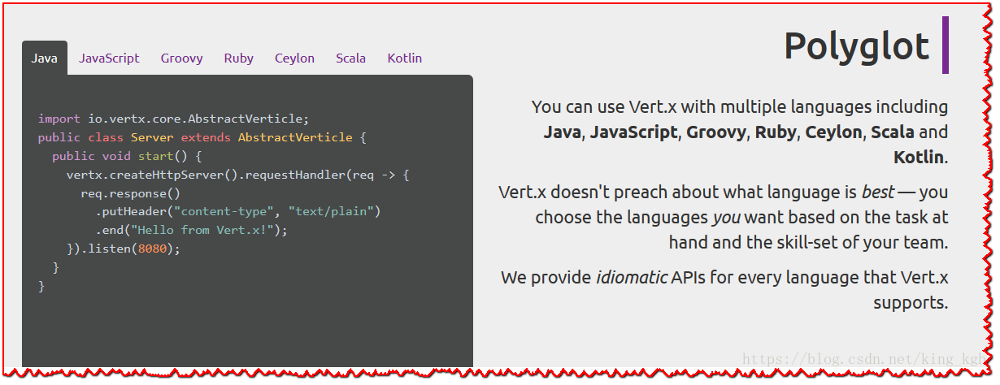
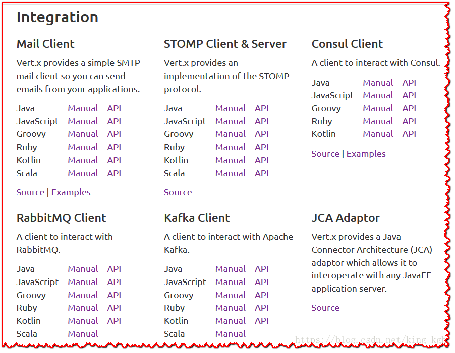

# Vert.x 核心手册中文版

> 翻译: 白石(https://github.com/wjw465150/Vert.x-Core-Manual)

# 摘要

Vert.x最大的特点就在于异步（底层基于Netty），通过事件循环（EventLoop）来调起存储在异步任务队列（CallBackQueue）中的任务，大大降低了传统阻塞模型中线程对于操作系统的开销。因此相比较传统的阻塞模型，异步模型能够很大层度的提高系统的并发量。

Vert.x除了异步之外，还提供了非常多的吸引人的技术，比如EventBus，通过EventBus可以非常简单的实现分布式消息，进而为分布式系统调用，微服务奠定基础。除此之外，还提供了对多种客户端的支持，比如Redis，RabbitMQ，Kafka等等。

Vert.x异步也带来了编码上的复杂性，想要编写优美的异步代码，就需要对lambda表达式、函数式编程、Reactive等技术非常熟悉才行，否则很容易导致你的代码一团糟，完全没有可读性。另外，异步模型的性能调优、异常处理与同步模型有很大差异，网络中相关资料较少，使用中遇到问题排查困难，这也是目前国内架构师不愿意选择Vert.x的原因。

Vert.x运行在Java虚拟机上，支持多种编程语言，Vert.x是高度模块化的，同一个应用，你可以选择多种编程语言同时开发。在Vert.x 2版本，也就是基于JDK7，还没有lambda的时候，一般来讲，使用JavaScript作为开发语言相对较多，到Vert.x3的时代，因为JDK8的出现，Java已经作为Vert.x主流的开发语言，而Vert.x也被更多的开发者所接受。

# Vert.x能干什么

***Java能做的，Vert.x都能做。主要讨论，Vert.x善于做哪些事情！***

（1）Web开发，Vert.x封装了Web开发常用的组件，支持路由、Session管理、模板等，可以非常方便的进行Web开发。**不需要容器！不需要容器！不需要容器！**

（2）TCP/UDP开发，Vert.x底层基于Netty，提供了丰富的IO类库，支持多种网络应用开发。**不需要处理底层细节（如拆包和粘包），注重业务代码编写。**

（3）提供对WebSocket的支持，可以做网络聊天室，动态推送等。

（4）Event Bus（事件总线）是Vert.x的神经系统，通过Event Bus可以实现分布式消息，远程方法调用等等。正是因为Event Bus的存在，Vert.x可以非常便捷的开发**微服务**应用。

（5）支持主流的数据和消息的访问
  redis mongodb rabbitmq kafka 等

（6）分布式锁，分布式计数器，分布式map的支持

# Vert.x的一些优势

## **（1）异步非阻塞**

Vert.x就像是跑在JVM之上的Nodejs，**所以Vert.x的第一个优势就是这是一个异步非阻塞框架**。上面也提到了异步，我们使用ajax来演示的异步，下面使用Vert.x请求远程地址一个代码，可以看到和ajax非常像！

```java
System.out.println("1")
 
WebClient
    .create(vertx)
    .postAbs(REQUEST_URL) // 这里指定的是请求的地址
    .sendBuffer(buffer, res -> { // buffer是请求的数据
 
        if (res.succeeded()) {  
            // 请求远程服务成功
            System.out.println("2")
            
        } else {
            // 请求失败
            resultHandler.handle(Future.failedFuture("请求服务器失败..."));
        }
    });
 
System.out.println("3")
```

这段代码的执行效果和上面的JavaScript执行的结果是类似的，同样是先打印 1，再打印 3，最后打印 2。

异步也是Vert.x于其他的JavaWeb框架的主要区别。我们这里先不去讨论异步的优势与他的实现原理，只要先知道，Vert.x和JavaScript一样，是一个异步执行的就可以了。

**Vert.x和JDK8**

Vert.x必须运行在JDK8上，JDK8提供了lambda表达式，可以简化匿名内部类的编写，可以极大的挺高代码的可读性。

上面的代码中看到 在 sendBuffer 这一行里有一个`->` 这种形式。这个是Java代码吗？ 是的。是JDK8提供的lambda表达式的形式。用于简化匿名内部类的开发。有兴趣的朋友可以了解一下lambda表达式，在使用Vertx进行项目开发时有大量的匿名内部类，因此很多情况会用到。

## **（2）Vertx支持多种编程语言**

Vert.x有一个口号大概是：“我们不去评判那个编程语言更好，你只要选择你想要使用的语言就可以了”。也就是说，在Vert.x上，可以使用JavaScript，Java，Scala，Ruby等等，下面是官网的一个截图



## **（3）不依赖中间件**

Vert.x的底层依赖Netty，因此在使用Vert.x构建Web项目时，不依赖中间件。像Node一样，可以直接创建一个HttServer。就像我们上面第一个例子，可以直接运行main方法，启动一个Http服务，而不需要使用类似于Tomcat的中间件。不依赖中间件进行开发，相对会更灵活一些，安全性也会更高一些。

## **（4）完善的生态**

Vert.x和Spring的对比，有一种使用MacOS和Windows对比的感觉。Vert.x和庞大的Spring家族体系不同，Vert.x提供数据库操作，Redis操作，Web客户端操作，NoSQL数据库的一些操作等常用的结构，很清新，很简洁，但足够使用。下面是从官网截取的一个提供的客户端工具。



## **（5）为微服务而生**

Vert .x提供了各种组件来构建基于微服务的应用程序。通过EventBus可以非常容易的进行服务之间的交互。并且提供了HAZELCAST来实现分布式。

当然了，除了一些优势以外，要在项目中选择使用Vert.x还要考虑一些问题，这里不展开说明，只是根据个人的使用经验提出一些点。

\* Vert.x使用JDK8的Lambda，所以要使用Vert.x首先需要对JDK8比较熟悉。当然，对于一个开发者，现在JDK已经出到JDK11了，JDK8的特性也理应该学习一下

\* 对于复杂的业务，可能会遇到Callback Hell问题（解决方案也有很多）

\* 由于异步的特征、契约创建、更高级的错误处理机制使得开发过程会相对更复杂。（来自并发编程网）

# **Vert.x技术体系**

上面也提到了，Vert.x和Spring一样，也有着完善的生态，具体可以查看https://github.com/vert-x3/vertx-awesome 我们可以看到，每一块内容都提供了多种的实现，有官方支持的版本还有社区版本。下面我们具体介绍下技术体系中官方支持的版本。

## **（1）核心模块**

Vert.x核心模块包含一些基础的功能，如HTTP，TCP，文件系统访问，EventBus、WebSocket、延时与重复执行、缓存等其他基础的功能，你可以在你自己的应用程序中直接使用。可以通过vertx-core模块引用即可。

##  **（2）Web模块**

Vert.x Web是一个工具集，虽然核心模块提供了HTTP的支持，但是要开发复杂的Web应用，还需要路由、Session、请求数据读取、Rest支持等等还需要Web模块，这里提供了上述的这些功能的API，便于开发。

除了对Web服务的开发以外，还提供了对**Web客户端**请求的支持，通过vertx-web-client即可方便的访问HTTP服务。有朋友可能会有疑惑，我明明可以使用JDK提供的URL来请求HTTP服务啊。使用Vert.x一定要注意，Vert.x是一个异步框架，请求HTTP服务是一个耗时操作，所有的耗时，都会阻塞EventBus，导致整体性能被拖垮，因此，对于请求Web服务，一定要使用Vert.x提供的vertx-web-client模块

##  **（3）数据访问模块**

Vert.x提供了对关系型数据库、NoSQL、消息中间件的支持，传统的客户端因为是阻塞的，会严重影响系统的性能，因此Vert.x提供了对以上客户端的异步支持。具体支持的数据访问如下：

MongoDB client,JDBC client,SQL common,Redis client,MySQL/PostgreSQLclient

##  **（4）Reactive响应式编程**

复杂的异步操作，会导致异步回调地狱的产生，看下面的代码，这是我在Vert.x提供的例子中找到的，我们不去管这段代码干了啥，只是看后面的}就很惊讶了，如果操作更为复杂一些，会嵌套的层次更多，通过reactive可以最小化的简化异步回调地狱。

```java
// create a test table
execute(conn.result(), "create table test(id int primary key, name varchar(255))", create -> {
  // start a transaction
  startTx(conn.result(), beginTrans -> {
    // insert some test data
    execute(conn.result(), "insert into test values(1, 'Hello')", insert -> {
      // commit data
      rollbackTx(conn.result(), rollbackTrans -> {
        // query some data
        query(conn.result(), "select count(*) from test", rs -> {
          for (JsonArray line : rs.getResults()) {
            System.out.println(line.encode());
          }
 
          // and close the connection
          conn.result().close(done -> {
            if (done.failed()) {
              throw new RuntimeException(done.cause());
            }
          });
        });
      });
    });
  });
});
```

再看一个使用Reactive2构建的多步操作的代码，paramCheckStep,insertPayDtlStep,requestStep等等都是异步方法，但这里就很好的处理了异步回调的问题，不再有那么多层的大括号，代码结构也更清晰.

```java
public void scanPay(JsonObject data, Handler<AsyncResult<JsonObject>> resultHandler) {
    paramCheckStep(data) // 参数校验
            .flatMap(this::insertPayDtlStep) // 插入流水
            .flatMap(x -> requestStep(x, config)) // 请求上游
            .flatMap(this::cleanStep) //参数清理
            .subscribe(ok -> {
                        logger.info("成功结束");
                        resultHandler.handle(Future.succeededFuture(ok));
                    },
                    err -> {
                        logger.error("正在结束", err);
                        resultHandler.handle(Future.failedFuture(err));
                    }
 
            );
}
```

## **（5）整合其他模块**

邮件客户端

Vert.x提供了一简单STMP邮件客户端，所以你可以在应用程序中发送电子邮件。

STOMP客户端与服务端

Vert.x提供了STOMP协议的实现包括客户端与服务端。

Consul Client

consul是google开源的一个使用go语言开发的服务发现、配置管理中心服务。内置了服务注册与发现框 架、分布一致性协议实现、健康检查、Key/Value存储、多数据中心方案。

RabbitMQ Client Kafka Client

消息队里的客户端支持

JCA适配器

Vert.x提供了Java连接器架构适配器，这允许同任意JavaEE应用服务器进行互操作。

## **（6）认证与授权**

Vert.x提供了简单API用于在应用中提供认证和授权。

Auth common 通用的认证API，可以通过重写AuthProvider类来实现自己的认证

JDBC auth 后台为JDBC的认证实现

JWT auth 用JSON Web tokens认证实现

Shiro auth 使用Apache Shiro认证实现

MongoDB auth MongoDB认证实现

OAuth 2 Oauth2协义认证实现

htdigest auth 这个是新增一种认证的支持

## **（7）微服务**

Vert.x提供多个组件构建基于微服务的应用程序。

比如服务发现(Vert.x Service Discovery)、断路器(Vert.x Circuit Breaker)、配置中心(Vert.x Config)等。

------

技术是为业务服务的，在选择架构的时候，也要考虑用人的成本，也正是因为如此，国内使用Vert.x的企业还不是很多。**但是我相信，未来，一定是异步非阻塞的天下!**

