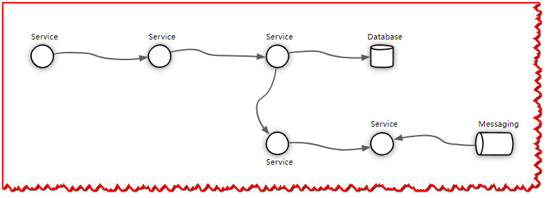
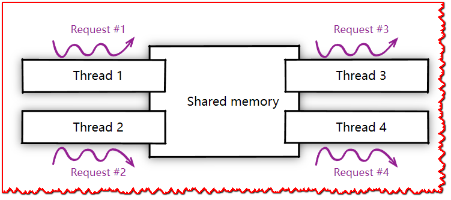
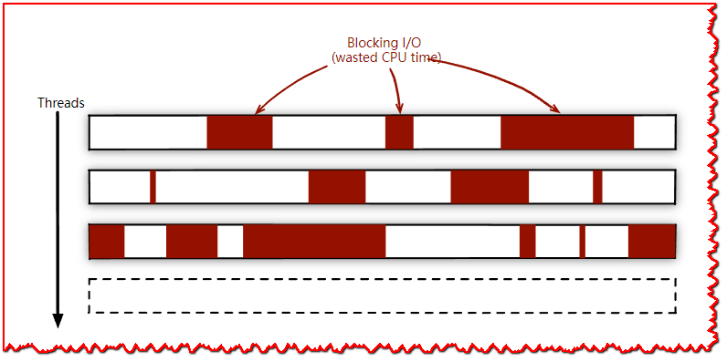
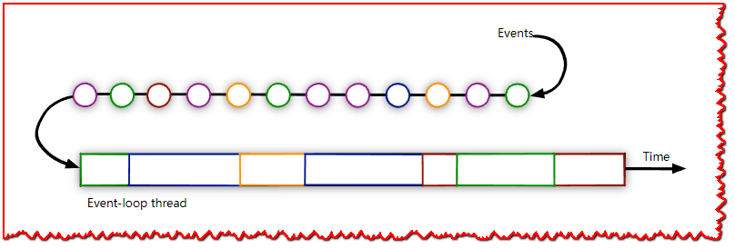
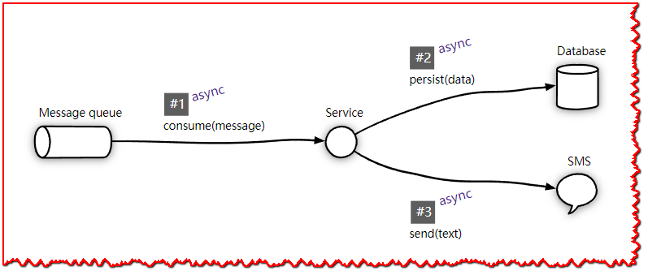
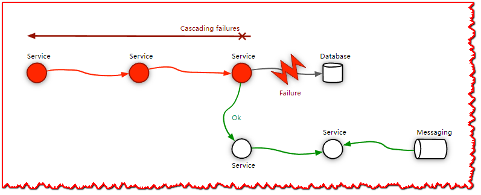
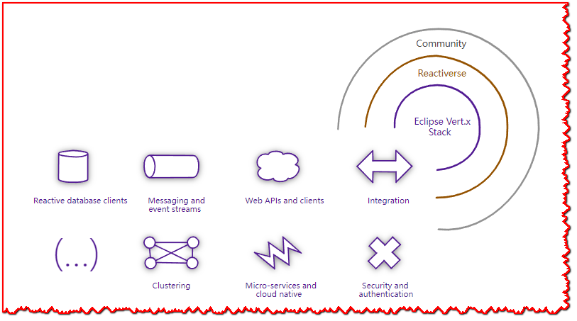

# Vert.x和Reactive简介

Eclipse Vert.x 是一个用于在 JVM 上构建 **reactive** 应用程序的工具包。 **反应式**应用程序既可以随着工作负载的增长而**可扩展(scal­able)**，又可以在出现故障时**可恢复(re­silient)**。 反应式应用程序是**瞬时响应的**，因为它通过有效利用系统资源和保护自己免受错误来控制延迟。

Vert.x 由一个庞大的响应式模块生态系统提供支持，提供了编写现代服务时所需的一切：全面的Web栈、响应式数据库驱动程序、消息传递、事件流、集群、指标、分布式跟踪等等。

Vert.x 是一个工具包，而不是一个附带黑魔法的框架：**您编写的内容实际上就是您要执行的内容**，就这么简单。

那么是什么让 Vert.x 成为编写下一个 **cloud-native(云原生)** 或 **[twelve-factor(12要素应用)](https://12factor.net/)** 应用程序的绝佳选择？

> "云原生与12要素(Cloud-Native & 12-Factor)", 参见我写的一个[blog](https://blog.csdn.net/wjw465150/article/details/126852385)

## 一开始，有一些线程……

并发编程的经典方法是使用**线程**。 多个线程可以存在于一个**进程**中，执行**并发**工作，并**共享**相同的内存空间。

大多数应用程序和服务开发框架都基于多线程。 从表面上看，**每个连接有 1 个线程**的模型令人放心，因为开发人员可以依赖传统的**命令式(im­per­a­tive style)**编程方式。

这种看起来挺美，特别是如果你忘记了在多线程和内存访问中可能犯的那些愚蠢的错误……

## 多线程很“简单”，但也有局限性

当工作负荷超出常规工作负荷时，会发生什么?[(参见C10k问题)](https://en.wikipedia.org/wiki/C10k_problem)

> **C10k problem:** C10k 问题是优化网络套接字以同时处理大量客户端的问题。 C10k 这个名字是并发处理一万个连接的数字名称。 处理许多并发连接与每秒处理许多请求是不同的问题：后者需要高吞吐量（快速处理它们），而前者不必很快，但需要高效的连接调度。

答案很简单：你开始让你的操作系统内核**受苦**，因为有太多的**上下文切换**处理正在进行的请求。

你的一些线程将被**阻塞**，因为它们正在**等待** I/O 操作完成，一些将**准备好**处理 I/O 结果，还有一些正在执行CPU密集型操作任务。

现代内核有非常好的调度器，但你不能指望它们处理 5万个线程就像处理 5千个线程一样容易。而且，线程并不便宜：创建一个线程需要几毫秒，而一个新线程需要至少大约 1MB 内存。

## 异步编程: 可伸缩性和资源效率

当您使用**异步 I/O** 时，可以使用更少的线程处理更多的并发连接。 当 I/O 操作发生时，我们不会阻塞线程，而是转移到另一个准备继续执行的任务，并在初始任务就绪后继续执行

Vert.x 使用**事件循环(event loops)**多路复用并发工作负载。

在事件循环上运行的代码不应执行阻塞 I/O 或冗长的处理。 但是如果你有这样的代码也不要担心：Vert.x 有工作线程和 API 来处理事件循环上的事件。

## 为您的问题领域选择最佳异步编程模型

我们知道，异步编程需要付出更多的努力。 Vert.x的核心，支持 **callbacks** 和 **promises/futures**，后者是用于链接异步操作的简单而优雅的模型。

使用 [RxJava](https://github.com/ReactiveX/RxJava) 可以实现高级反应式编程，如果您更喜欢更接近传统命令式编程的东西，那么我们为您提供 [Kotlin 协程 ](https://kotlinlang.org/docs/reference/coroutines-overview.html)的一流支持。

Vert.x支持多种异步编程模型: 为你需要解决的每个问题选择最适合的模型!

## 不要让失败破坏响应能力

失败经常会发生。数据库会中断，网络会中断，或者您所依赖的某些服务会失去响应。

Vert.x 提供了保持延迟在控制之下的工具，包括一个简单高效的**断路器**。

> **断路器**的目标是防止出现对内部发生故障的系统的请求堆积起来，导致分布式服务之间的级联错误。断路器充当(网络)请求(如RPC调用、HTTP请求或数据库调用)和要调用的服务之间的代理形式。

## 丰富的生态系统

*Vert.x 堆栈* 包含用于构建现代端到端反应式服务的模块。 从高效的响应式数据库客户端到事件流、消息传递和 Web 堆栈，Vert.x 工具包为您提供：

找不到您要查找的内容？

- [The Reactiveerse](https://reactiveerse.io/) 是一个围绕响应式生态系统的更大社区，您可以在其中找到更多客户端和模块。
- [Vert.x Awesome](https://github.com/vert-x3/vertx-awesome) 存储库提供了来自更大开源社区的更多有趣项目的链接！