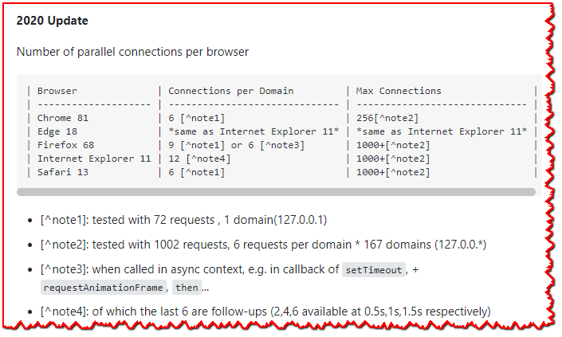

# SockJS-client简介

# SockJS企业版

可作为Tidelift订阅的一部分。

SockJS和数千个其他包的维护者正在与Tidelift合作，为您用于构建应用程序的开源依赖关系提供商业支持和维护。节省时间、降低风险并改善代码运行状况，同时为您使用的确切依赖项支付维护者费用。[了解更多](https://tidelift.com/subscription/pkg/npm-sockjs-client?utm_source=npm-sockjs-client&utm_medium=referral&utm_campaign=enterprise&utm_term=repo)

# 概述

SockJS是一个浏览器JavaScript库，提供了一个类似websocket的对象。SockJS为您提供了一个连贯的，跨浏览器的Javascript API，它在浏览器和web服务器之间创建了一个低延迟，全双工，跨域通信通道。

实际上，SockJS首先尝试使用本地WebSockets。如果失败了，它可以使用各种特定于浏览器的传输协议，并通过类似websocket的抽象来表示它们。

SockJS旨在适用于所有现代浏览器和不支持WebSocket协议的环境——例如，在限制性的公司代理之后。

SockJS-client确实需要一个对应的服务器:

- [SockJS-node](https://github.com/sockjs/sockjs-node) 是Node.js的SockJS服务器。

原则:

- API应该尽可能地遵循 [HTML5 Websockets API](https://www.w3.org/TR/websockets/)。
- 所有传输必须支持开箱即用的跨域连接。可以并且建议将SockJS服务器托管在与主网站不同的服务器上。
- 每个主流浏览器都至少支持一种流协议。
- 流传输应该跨域工作，并且应该支持cookie(用于基于cookie的粘滞会话)。
- 轮询传输用作旧浏览器和受限制代理后面的主机的回退。
- 连接建立应快速、轻便。
- 内部没有Flash(不需要打开端口843 -不需要通过代理工作，不需要托管'crossdomain.xml'，不需要[等待3秒](https://github.com/gimite/web-socket-js/issues/49)以检测问题)

订阅[SockJS邮件列表](https://groups.google.com/forum/#!forum/sockjs)进行讨论和支持。

# SockJS 家族

- [SockJS-client](https://github.com/sockjs/sockjs-client) JavaScript client library
- [SockJS-node](https://github.com/sockjs/sockjs-node) Node.js server
- [SockJS-erlang](https://github.com/sockjs/sockjs-erlang) Erlang server
- [SockJS-cyclone](https://github.com/flaviogrossi/sockjs-cyclone) Python/Cyclone/Twisted server
- [SockJS-tornado](https://github.com/MrJoes/sockjs-tornado) Python/Tornado server
- [SockJS-twisted](https://github.com/DesertBus/sockjs-twisted/) Python/Twisted server
- [SockJS-aiohttp](https://github.com/aio-libs/sockjs/) Python/Aiohttp server
- [Spring Framework](https://projects.spring.io/spring-framework) Java [client](https://docs.spring.io/spring-framework/docs/current/spring-framework-reference/web.html#websocket-fallback-sockjs-client) & server
- [vert.x](https://github.com/vert-x/vert.x) Java/vert.x server
- [Xitrum](https://xitrum-framework.github.io/) Scala server
- [Atmosphere Framework](https://github.com/Atmosphere/atmosphere) JavaEE Server, Play Framework, Netty, Vert.x
- [Actix SockJS](https://github.com/fafhrd91/actix-sockjs) Rust Server, Actix Framework

进行中的工作:

- [SockJS-ruby](https://github.com/nyarly/sockjs-ruby)
- [SockJS-netty](https://github.com/cgbystrom/sockjs-netty)
- [SockJS-gevent](https://github.com/ksava/sockjs-gevent) ([SockJS-gevent fork](https://github.com/njoyce/sockjs-gevent))
- [pyramid-SockJS](https://github.com/fafhrd91/pyramid_sockjs)
- [wildcloud-websockets](https://github.com/wildcloud/wildcloud-websockets)
- [wai-SockJS](https://github.com/Palmik/wai-sockjs)
- [SockJS-perl](https://github.com/vti/sockjs-perl)
- [SockJS-go](https://github.com/igm/sockjs-go/)
- [syp.biz.SockJS.NET](https://github.com/sypbiz/SockJS.NET) - .NET port of the SockJS client

# 开始

SockJS 模仿 [WebSockets API](https://www.w3.org/TR/websockets/)，但不是 `WebSocket`，而是 `SockJS` Javascript 对象。

首先，您需要加载 SockJS JavaScript 库。 例如，你可以把它放在你的 HTML 头部：

```javascript
<script src="https://cdn.jsdelivr.net/npm/sockjs-client@1/dist/sockjs.min.js"></script>
```

After the script is loaded you can establish a connection with the SockJS server. Here's a simple example:

```javascript
 var sock = new SockJS('https://mydomain.com/my_prefix');
 sock.onopen = function() {
     console.log('open');
     sock.send('test');
 };

 sock.onmessage = function(e) {
     console.log('message', e.data);
     sock.close();
 };

 sock.onclose = function() {
     console.log('close');
 };
```

# SockJS-client API

## SockJS 类

与`WebSocket` API 类似，`SockJS`构造函数采用一个或多个参数：

```javascript
var sockjs = new SockJS(url, _reserved, options);
```

`url` 可以包含一个查询字符串，如果需要的话。

其中 `options` 是一个散列，它可以包含：

- **server (字符串)**

  要附加到实际数据连接的 url 的字符串。 默认为随机的 4 位数字。

- **transports (字符串 或者 字符串数组)**

  有时禁用一些后备传输很有用。 此选项允许您提供 SockJS 可能使用的传输列表。 默认情况下，将使用所有可用的传输。

- **sessionId (数字 或者 函数)**

  客户端和服务器都使用会话标识符来区分连接。如果您将此选项指定为数字，SockJS 将使用其随机字符串生成器函数生成 N 个字符长的会话 ID（其中 N 对应于 **sessionId** 指定的数字）。当您将此选项指定为一个函数时，该函数必须返回一个随机生成的字符串。每次 SockJS 需要生成会话 ID 时，它都会调用此函数并直接使用返回的字符串。如果不指定此选项，则默认使用默认的随机字符串生成器生成 8 个字符的长会话 ID。

- **timeout (数字)**

  指定用于传输连接的最小超时时间（以毫秒为单位, 默认是 5 毫秒）。默认情况下，这是根据测量的 RTT 和预期往返次数动态计算的。此设置将建立一个最小值，但如果计算出的超时值更高，则会使用该值。

> <mark>**译者白石注**</mark> 例如:   A WebSocket was created,uri: `/eventbus/843/zsqys1m5/websocket`,其中:
>
> - `843` 是 server 
> - `zsqys1m5` 是 sessionId 
> - `websocket` 是 transports 

虽然 `SockJS` 对象试图模拟 `WebSocket` 行为，但不可能支持它的所有功能。SockJS 的一个重要限制是您不允许一次打开一个以上的 SockJS 连接到一个域。此限制是由传出连接的浏览器内限制引起的 - 通常[浏览器不允许打开两个以上的传出连接到单个域](https://stackoverflow.com/questions/985431/max-parallel-http-connections-in-a-browser)。一个 SockJS 会话需要这两个连接 - 一个用于下载数据，另一个用于发送消息。同时打开第二个 SockJS 会话很可能会阻塞，并可能导致两个会话超时。

一次打开多个 SockJS 连接通常是一种不好的做法。如果你绝对必须这样做，你可以使用多个子域，为每个SockJS连接使用不同的子域。
> <mark>**译者白石注:**</mark> 现代的浏览器早已支持同一个域可以打开多个连接了.
>
> 

# 支持的传输，按浏览器（从 http:// 或 https:// 提供的 html）

| *Browser*             | *Websockets*      | *Streaming*        | *Polling*          |
| --------------------- | ----------------- | ------------------ | ------------------ |
| IE 6, 7               | no                | no                 | jsonp-polling      |
| IE 8, 9 (cookies=no)  | no                | xdr-streaming †    | xdr-polling †      |
| IE 8, 9 (cookies=yes) | no                | iframe-htmlfile    | iframe-xhr-polling |
| IE 10                 | rfc6455           | xhr-streaming      | xhr-polling        |
| Chrome 6-13           | hixie-76          | xhr-streaming      | xhr-polling        |
| Chrome 14+            | hybi-10 / rfc6455 | xhr-streaming      | xhr-polling        |
| Firefox <10           | no ‡              | xhr-streaming      | xhr-polling        |
| Firefox 10+           | hybi-10 / rfc6455 | xhr-streaming      | xhr-polling        |
| Safari 5.x            | hixie-76          | xhr-streaming      | xhr-polling        |
| Safari 6+             | rfc6455           | xhr-streaming      | xhr-polling        |
| Opera 10.70+          | no ‡              | iframe-eventsource | iframe-xhr-polling |
| Opera 12.10+          | rfc6455           | xhr-streaming      | xhr-polling        |
| Konqueror             | no                | no                 | jsonp-polling      |

- **†**: IE 8+ 支持[XDomainRequest]^[1]^(https://github.com/sockjs/sockjs-client#user-content-fn-9-a585ebdccb2f8f0e0f2f1a448ce422c1), 它本质上是一个修改后的 AJAX/XHR，可以跨域进行请求。 但不幸的是，它不发送任何 cookie，这使得它不适合在负载均衡器使用 JSESSIONID cookie 进行粘性会话时进行部署。
- **‡**: Firefox 4.0和Opera 11.00，并附带禁用Websockets“hixie-76”。 它们仍然可以通过手动更改浏览器设置来启用。

# 支持的传输，由浏览器（从 file:// 提供的 html）

有时您可能希望从“file://”地址提供您的 html - 用于开发或者如果您正在使用 PhoneGap 或类似技术。但是由于跨源策略，从“file://”提供的文件没有源，这意味着某些 SockJS 传输将无法工作。由于这个原因，SockJS 传输表与通常不同，主要区别是：

| *Browser* | *Websockets*  | *Streaming*        | *Polling*          |
| --------- | ------------- | ------------------ | ------------------ |
| IE 8, 9   | no            | iframe-htmlfile    | iframe-xhr-polling |
| Other     | same as above | iframe-eventsource | iframe-xhr-polling |

# 支持的传输，按名称

| *Transport*          | *References*                                                 |
| -------------------- | ------------------------------------------------------------ |
| websocket (rfc6455)  | [rfc 6455][2](https://github.com/sockjs/sockjs-client#user-content-fn-10-a585ebdccb2f8f0e0f2f1a448ce422c1) |
| websocket (hixie-76) | [draft-hixie-thewebsocketprotocol-76][3](https://github.com/sockjs/sockjs-client#user-content-fn-1-a585ebdccb2f8f0e0f2f1a448ce422c1) |
| websocket (hybi-10)  | [draft-ietf-hybi-thewebsocketprotocol-10][4](https://github.com/sockjs/sockjs-client#user-content-fn-2-a585ebdccb2f8f0e0f2f1a448ce422c1) |
| xhr-streaming        | Transport using [Cross domain XHR][5](https://github.com/sockjs/sockjs-client#user-content-fn-5-a585ebdccb2f8f0e0f2f1a448ce422c1) [streaming][6](https://github.com/sockjs/sockjs-client#user-content-fn-7-a585ebdccb2f8f0e0f2f1a448ce422c1) capability (readyState=3). |
| xdr-streaming        | Transport using [XDomainRequest][1](https://github.com/sockjs/sockjs-client#user-content-fn-9-a585ebdccb2f8f0e0f2f1a448ce422c1) [streaming][6](https://github.com/sockjs/sockjs-client#user-content-fn-7-a585ebdccb2f8f0e0f2f1a448ce422c1) capability (readyState=3). |
| eventsource          | [EventSource/Server-sent events][7](https://github.com/sockjs/sockjs-client#user-content-fn-4-a585ebdccb2f8f0e0f2f1a448ce422c1). |
| iframe-eventsource   | [EventSource/Server-sent events][7](https://github.com/sockjs/sockjs-client#user-content-fn-4-a585ebdccb2f8f0e0f2f1a448ce422c1) used from an [iframe via postMessage][8](https://github.com/sockjs/sockjs-client#user-content-fn-3-a585ebdccb2f8f0e0f2f1a448ce422c1). |
| htmlfile             | [HtmlFile][9](https://github.com/sockjs/sockjs-client#user-content-fn-8-a585ebdccb2f8f0e0f2f1a448ce422c1). |
| iframe-htmlfile      | [HtmlFile][9](https://github.com/sockjs/sockjs-client#user-content-fn-8-a585ebdccb2f8f0e0f2f1a448ce422c1) used from an [iframe via postMessage][8](https://github.com/sockjs/sockjs-client#user-content-fn-3-a585ebdccb2f8f0e0f2f1a448ce422c1). |
| xhr-polling          | Long-polling using [cross domain XHR][5](https://github.com/sockjs/sockjs-client#user-content-fn-5-a585ebdccb2f8f0e0f2f1a448ce422c1). |
| xdr-polling          | Long-polling using [XDomainRequest][1](https://github.com/sockjs/sockjs-client#user-content-fn-9-a585ebdccb2f8f0e0f2f1a448ce422c1). |
| iframe-xhr-polling   | Long-polling using normal AJAX from an [iframe via postMessage][8](https://github.com/sockjs/sockjs-client#user-content-fn-3-a585ebdccb2f8f0e0f2f1a448ce422c1). |
| jsonp-polling        | Slow and old fashioned [JSONP polling][10](https://github.com/sockjs/sockjs-client#user-content-fn-6-a585ebdccb2f8f0e0f2f1a448ce422c1). This transport will show "busy indicator" (aka: "spinning wheel") when sending data. |

# 在没有客户端的情况下连接到 SockJS

虽然 SockJS 的主要目的是启用浏览器到服务器的连接，但也可以从外部应用程序连接到 SockJS。任何符合 0.3 协议的 SockJS 服务器都支持原始 WebSocket url。测试服务器的原始WebSocket url如下所示:

- ws://localhost:8081/echo/websocket

您可以将任何符合 WebSocket RFC 6455 标准的 WebSocket 客户端连接到此 url。这可以是命令行客户端、外部应用程序、第三方代码甚至是浏览器（尽管我不知道您为什么要这样做）。

# 部署

您应该使用支持服务器使用的协议的 sockjs-client 版本。 例如：

```javascript
<script src="https://cdn.jsdelivr.net/npm/sockjs-client@1/dist/sockjs.min.js"></script>
```

关于服务器端部署技巧，特别是关于负载平衡和会话粘连的技巧，请参阅[SockJS-node readme](https://github.com/sockjs/sockjs-node#readme)。

# 开发 和 测试

SockJS-client需要[node.js](https://nodejs.org/)来运行测试服务器和简化JavaScript。如果你想使用SockJS-client源代码，签出git repo并遵循以下步骤:

```bash
cd sockjs-client
npm install
```

要生成JavaScript，运行:

```bash
gulp browserify
```

要生成最小化的JavaScript，运行:

```bash
gulp browserify:min
```

这两个命令都输出到 `build` 目录。

## 测试

由以下机构提供的自动化测试:

[](https://browserstack.com/)

编译 SockJS-client 后，您可能想检查您的更改是否通过了所有测试。

```bash
npm run test:browser_local
```

这将启动 [karma](https://karma-runner.github.io/) 和测试支持服务器。

# 浏览器怪癖

我们不打算解决各种浏览器怪癖：

- 在 Firefox 20 之前，在 Firefox 中按 ESC 会关闭 SockJS 连接。有关解决方法和讨论，请参阅 [#18](https://github.com/sockjs/sockjs-client/issues/18)。
- `jsonp-polling` 传输在发送数据时会显示一个“纺车”（又名“忙指示器”）。
- 由于[浏览器的并发连接限制](https://stackoverflow.com/questions/985431/max-parallel-http-connections-in-a-browser)，您不能同时打开多个SockJS连接到一个域(此限制不包括本机WebSocket连接)。
- 虽然SockJS正在尝试转义任何奇怪的Unicode字符(甚至是无效字符-[像替身\xD800-\xDBFF ](https://en.wikipedia.org/wiki/Mapping_of_Unicode_characters#Surrogates)或 [\xFFFE和\xFFFF](https://en.wikipedia.org/wiki/Unicode#Character_General_Category))，但建议只使用有效字符。使用无效字符有点慢，并且可能不适用于具有适当 Unicode 支持的 SockJS 服务器。
- 拥有一个名为 `onmessage` 的全局函数可能不是一个好主意，因为它可以由内置的 `postMessage` API 调用。
- 从 SockJS 的角度来看，SSL/HTTPS 没有什么特别之处。未加密和加密站点之间的连接应该可以正常工作。
- 尽管 SockJS 尽最大努力支持基于前缀和基于 cookie 的粘性会话，但后者可能无法与默认情况下不接受第三方 cookie 的浏览器 (Safari) 跨域良好地工作。为了解决这个问题，请确保您从与主站点相同的父域连接到 SockJS。例如，如果您从“[www.a.com](http://www.a.com/)”或“a.com”连接，“sockjs.a.com”能够设置 cookie。
- 尝试从安全的“https://”连接到不安全的“http://”不是一个好主意。反过来应该没问题。
- 众所周知，长轮询会导致 Heroku 出现问题，但 [SockJS 的解决方法可用](https://github.com/sockjs/sockjs-node/issues/57#issuecomment-5242187)。
- SockJS [websocket传输在SSL上更稳定](https://github.com/sockjs/sockjs-client/issues/94)。如果你是一个严肃的SockJS用户，那么考虑使用SSL([更多信息](https://www.ietf.org/mail-archive/web/hybi/current/msg01605.html))。

## 脚注

1. https://blogs.msdn.microsoft.com/ieinternals/2010/05/13/xdomainrequest-restrictions-limitations-and-workarounds/ [↩](https://github.com/sockjs/sockjs-client#user-content-fnref-9-a585ebdccb2f8f0e0f2f1a448ce422c1) [↩2](https://github.com/sockjs/sockjs-client#user-content-fnref-9-2-a585ebdccb2f8f0e0f2f1a448ce422c1) [↩3](https://github.com/sockjs/sockjs-client#user-content-fnref-9-3-a585ebdccb2f8f0e0f2f1a448ce422c1)
2. https://www.rfc-editor.org/rfc/rfc6455.txt [↩](https://github.com/sockjs/sockjs-client#user-content-fnref-10-a585ebdccb2f8f0e0f2f1a448ce422c1)
3. https://tools.ietf.org/html/draft-hixie-thewebsocketprotocol-76 [↩](https://github.com/sockjs/sockjs-client#user-content-fnref-1-a585ebdccb2f8f0e0f2f1a448ce422c1)
4. https://tools.ietf.org/html/draft-ietf-hybi-thewebsocketprotocol-10 [↩](https://github.com/sockjs/sockjs-client#user-content-fnref-2-a585ebdccb2f8f0e0f2f1a448ce422c1)
5. https://secure.wikimedia.org/wikipedia/en/wiki/XMLHttpRequest#Cross-domain_requests [↩](https://github.com/sockjs/sockjs-client#user-content-fnref-5-a585ebdccb2f8f0e0f2f1a448ce422c1) [↩2](https://github.com/sockjs/sockjs-client#user-content-fnref-5-2-a585ebdccb2f8f0e0f2f1a448ce422c1)
6. http://www.debugtheweb.com/test/teststreaming.aspx [↩](https://github.com/sockjs/sockjs-client#user-content-fnref-7-a585ebdccb2f8f0e0f2f1a448ce422c1) [↩2](https://github.com/sockjs/sockjs-client#user-content-fnref-7-2-a585ebdccb2f8f0e0f2f1a448ce422c1)
7. https://html.spec.whatwg.org/multipage/comms.html#server-sent-events [↩](https://github.com/sockjs/sockjs-client#user-content-fnref-4-a585ebdccb2f8f0e0f2f1a448ce422c1) [↩2](https://github.com/sockjs/sockjs-client#user-content-fnref-4-2-a585ebdccb2f8f0e0f2f1a448ce422c1)
8. https://developer.mozilla.org/en/DOM/window.postMessage [↩](https://github.com/sockjs/sockjs-client#user-content-fnref-3-a585ebdccb2f8f0e0f2f1a448ce422c1) [↩2](https://github.com/sockjs/sockjs-client#user-content-fnref-3-2-a585ebdccb2f8f0e0f2f1a448ce422c1) [↩3](https://github.com/sockjs/sockjs-client#user-content-fnref-3-3-a585ebdccb2f8f0e0f2f1a448ce422c1)
9. http://cometdaily.com/2007/11/18/ie-activexhtmlfile-transport-part-ii/ [↩](https://github.com/sockjs/sockjs-client#user-content-fnref-8-a585ebdccb2f8f0e0f2f1a448ce422c1) [↩2](https://github.com/sockjs/sockjs-client#user-content-fnref-8-2-a585ebdccb2f8f0e0f2f1a448ce422c1)
10. https://secure.wikimedia.org/wikipedia/en/wiki/JSONP [↩](https://github.com/sockjs/sockjs-client#user-content-fnref-6-a585ebdccb2f8f0e0f2f1a448ce422c1)


# 各种问题和设计注意事项

## WebSocket兼容的负载均衡器

https://openbase.com/js/sockjs/documentation

通常 WebSockets 不能很好地与代理和负载均衡器一起使用。 在 Nginx 或 Apache 后面部署 SockJS 服务器可能会很痛苦。

幸运的是，一个优秀的负载均衡器[HAProxy](http://haproxy.1wt.eu/)的最新版本能够代理WebSocket连接。我们建议将HAProxy作为前端负载均衡器，并使用它将 SockJS 流量与普通 HTTP 数据分开。查看示例 [SockJS HAProxy 配置](https://github.com/sockjs/sockjs-node/blob/master/examples/haproxy.cfg)。

`haproxy.cfg`文件:

```ini
# Requires recent Haproxy to work with websockets (for example 1.4.16).
defaults
    mode http
    # Set timeouts to your needs
    timeout client  5s
    timeout connect 5s
    timeout server  5s

frontend all 0.0.0.0:8888
    mode http
    timeout client 120s

    option forwardfor
    # Fake connection:close, required in this setup.
    option http-server-close
    option http-pretend-keepalive

    acl is_sockjs path_beg /echo /broadcast /close
    acl is_stats  path_beg /stats

    use_backend sockjs if is_sockjs
    use_backend stats if is_stats
    default_backend static


backend sockjs
    # 根据从 url 路径中的前两个目录创建的哈希进行负载平衡。 
    # 例如，去往 `/1/` 的请求应该由单个服务器处理（假设资源前缀是一级深度，如“/eventbus”）。  
    # 例如SockJS的URL `/eventbus/843/zsqys1m5/websocket`
    balance uri depth 2
    timeout server  120s
    server srv_sockjs1 127.0.0.1:9999
    # server srv_sockjs2 127.0.0.1:9998

backend static
    balance roundrobin
    server srv_static 127.0.0.1:8000

backend stats
    stats uri /stats
    stats enable
```

该配置还展示了如何使用 HAproxy 平衡在多个 Node.js 服务器之间拆分流量。 您还可以使用 DNS 名称进行平衡。

## 粘性会话

如果您计划部署多个SockJS服务器，则必须确保单个会话的所有HTTP请求都将命中同一个服务器。SockJS有两种机制可以实现这一点:

- URL 以服务器和会话 ID 编号为前缀，例如：`/resource/<server_number>/<session_id>/transport`。 这对于支持基于前缀的关联（HAProxy 支持）的负载均衡器很有用。
- `JSESSIONID` cookie 由 SockJS 节点设置。 如果设置了该 cookie，许多负载平衡器会打开粘性会话。 此技术源自 Java 应用程序，其中通常需要粘性会话。 HAProxy 以及一些托管服务提供商（例如 CloudFoundry）确实支持这种方法。 为了在客户端启用此方法，请向 SockJS 构造函数提供 `cookie:true` 选项。

## 授权

SockJS 节点不会向应用程序公开 cookie。 这是故意这样做的，因为在 SockJS 中使用基于 cookie 的授权根本没有意义，并且会导致安全问题。

cookie是浏览器和http服务器之间的契约，由域名标识。如果浏览器为特定的域设置了cookie，它将把它作为所有http请求的一部分传递给主机。但是为了让各种传输工作，SockJS使用了一个中间人

- 一个来自目标SockJS域的iframe。这意味着服务器将从iframe接收请求，而不是从真实域接收请求。iframe的域和SockJS的域是一样的。问题是任何网站都可以嵌入iframe并与之通信-并请求建立SockJS连接。在这种情况下，使用cookie进行授权将导致从任何网站授予SockJS与您的网站通信的完全访问权。这是典型的CSRF攻击。

基本上- cookie不适合SockJS模型。如果你想授权一个会话-在一个页面上提供一个唯一的令牌，首先通过SockJS连接发送它，并在服务器端验证它。本质上，这就是cookie的工作原理。