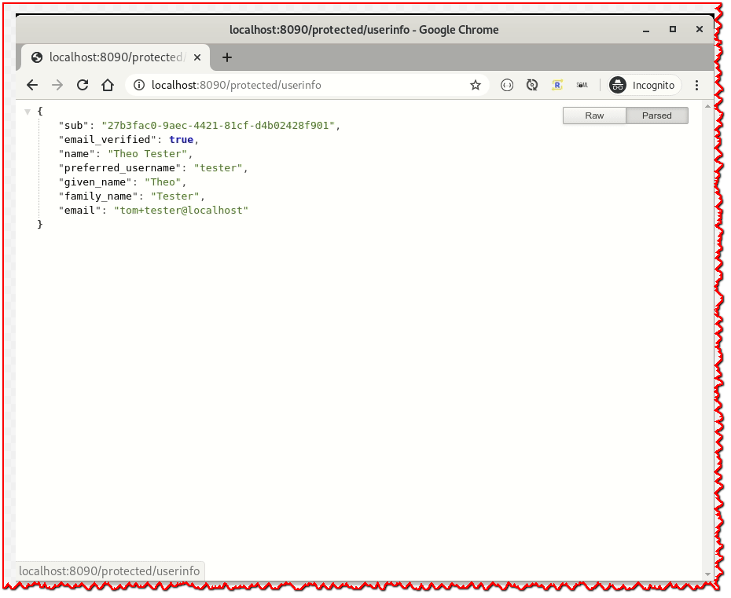

# 使用 Keycloak 的 Vert.x 简易SSO(单点登录)

> 原文: https://vertx.io/blog/easy-sso-for-vert-x-with-keycloak/

在这篇博文中，您将了解：

- 如何使用 OpenID Connect 实现单点登录
- 如何使用Keycloak的OpenID Discovery来推断OpenID提供程序配置
- 如何获取用户信息
- 如何检查授权
- 如何使用访问令牌调用受持有者保护的服务
- 如何实现基于表单的注销

## 你好博客

这是我在 Vert.x 博客上的第一篇文章，我必须承认，到目前为止，我从未在实际项目中使用 Vert.x。“你为什么在这里？”，你可能会问...好吧，我目前有两个主要爱好，学习新事物和使用[Key­cloak](https://www.keycloak.org/)保护应用程序。所以几天前，我在YouTube上偶然发现了Deven Phillips的[Vert.x简介视频系列](https://www.youtube.com/watch?v=LsaXy7SRXMY&list=PLkeCJDaCC2ZsnySdg04Aq9D9FpAZY6K5D)，我立即被迷住了。Vert.x对我来说是一件新鲜事，所以下一个合乎逻辑的步骤是弄清楚如何使用Keycloak保护Vert.x应用程序。

在本例中，我使用 Vert.x 构建了一个小型 Web 应用程序，该应用程序演示如何使用 Keycloak 和 OpenID Connect 实现单点登录 （SSO）、获取有关当前用户的信息、检查角色、调用承载保护服务和正确处理注销。

## Keycloak

Keycloak是一个开源的身份和访问管理解决方案，它为基于OpenID Connect的Singe-Signon提供了支持，等等。我简要地寻找了使用 Keycloak 保护 Vert.x 应用程序的方法，并很快在这篇博客中找到了一个较旧的 Vert.x Keycloak 集成示例。虽然这对初学者来说是一个良好的开端，但该示例包含一些问题，例如：

- 它使用硬编码的 OpenID 提供程序配置
- 具有非常简单的集成（为了简单起见）
- 未使用用户信息
- 不显示注销功能

这不知何故让我有点厌恶，因此，经过一整天的咨询工作后，我坐下来创建了一个基于 [Vert.x OpenID Con­nect / OAuth2 Sup­port](https://vertx.io/docs/vertx-auth-oauth2/java/) 支持的完整 Keycloak 集成示例。

所以让我们开始吧！

### Keycloak 设置

要使用Keycloak保护Vert.x应用程序，我们当然需要一个Keycloak实例。虽然Keycloak有一个很棒的入门指南，但我想让把所有东西放在一起更容易一些，因此我准备了一个本地的Keycloak docker容器，你可以轻松上手，它带有所有必需的配置。

名为 `vertx` 的预配置 Keycloak 领域包含一个用于我们的 Vert.x 网络应用程序的 `demo-client` 和一组用于测试的用户。

```bash
docker run \
  -it \
  --name vertx-keycloak \
  --rm \
  -e KEYCLOAK_USER=admin \
  -e KEYCLOAK_PASSWORD=admin \
  -e KEYCLOAK_IMPORT=/tmp/vertx-realm.json \
  -v $PWD/vertx-realm.json:/tmp/vertx-realm.json \
  -p 8080:8080 \
  quay.io/keycloak/keycloak:9.0.0
```

## Vert.x Web App Vert.x 网页应用

The sim­ple web app con­sists of a sin­gle `Verticle`, runs on `http://localhost:8090` and pro­vides a few routes with pro­tected re­sources. [You can find the com­plete ex­am­ple here](https://github.com/thomasdarimont/vertx-playground/blob/master/keycloak-vertx/src/main/java/demo/MainVerticle.java).
简单的 Web 应用程序由单个 `Verticle` 组成，在 `http://localhost:8090` 上运行，并提供一些具有受保护资源的路由。 您可以在[此处](https://github.com/thomasdarimont/vertx-playground/blob/master/keycloak-vertx/src/main/java/demo/MainVerticle.java))找到完整的示例。

Web 应用包含以下带有处理程序的路由：

- `/` - 未受保护的索引页
- `/protected` - 显示问候消息的受保护页面，用户需要登录才能访问此路径下的页面。
- `/protected/user` - 受保护的用户页面，显示有关用户的一些信息。
- `/protected/admin` - 受保护的管理员页面，其中显示有关管理员的一些信息，只有角色为 `admin` 的用户才能访问此页面。
- `/protected/userinfo` - 受保护的用户信息页面，从 Keycloak 中的持有者令牌保护的用户信息端点获取用户信息。
- `/logout` - 受保护的注销资源，用于触发用户注销。

### 运行应用

要运行应用程序，我们需要通过以下方式构建应用程序：

```bash
cd keycloak-vertx
mvn clean package
```

This cre­ates a runnable jar, which we can run via:
这将创建一个可运行的 jar，我们可以通过以下方式运行它：

```bash
java -jar target/*.jar
```

Note, that you need to start Key­cloak, since our app will try to fetch con­fig­u­ra­tion from Key­cloak.
请注意，您需要启动Keycloak，因为我们的应用程序将尝试从Keycloak获取配置。

If the ap­pli­ca­tion is run­ning, just browse to: `http://localhost:8090/`.
如果应用程序正在运行，只需浏览到： `http://localhost:8090/` 。

An ex­am­ple in­ter­ac­tion with the app can be seen in the fol­low­ing gif:
与应用程序的交互示例可以在以下 gif 中看到：





### Router, SessionStore and CSRF Protection 路由器、会话存储和 CSRF 保护

We start the con­fig­u­ra­tion of our web app by cre­at­ing a `Router` where we can add cus­tom han­dler func­tions for our routes. To prop­erly han­dle the au­then­ti­ca­tion state we need to cre­ate a `SessionStore` and at­tach it to the `Router`. The `SessionStore` is used by our OAuth2/OpenID Con­nect in­fra­struc­ture to as­so­ciate au­then­ti­ca­tion in­for­ma­tion with a ses­sion. By the way, the `SessionStore` can also be clus­tered if you need to dis­trib­ute the server-side state.
我们通过创建一个 `Router` 开始配置 Web 应用程序，我们可以在其中为路由添加自定义处理程序函数。要正确处理身份验证状态，我们需要创建一个 `SessionStore` 并将其附加到 `Router` .我们的 OAuth2/OpenID Connect 基础架构使用 `SessionStore` 将身份验证信息与会话相关联。顺便说一下，如果需要分发服务器端状态， `SessionStore` 也可以群集。

Note that if you want to keep your server state­less but still want to sup­port clus­ter­ing, then you could pro­vide your own im­ple­men­ta­tion of a `SessionStore` which stores the ses­sion in­for­ma­tion as an en­crypted cookie on the Client.
请注意，如果要使服务器保持无状态但仍希望支持群集，则可以提供自己的 `SessionStore` 实现，该实现将会话信息作为加密 cookie 存储在客户端上。

```java
Router router = Router.router(vertx);

// Store session information on the server side
SessionStore sessionStore = LocalSessionStore.create(vertx);
SessionHandler sessionHandler = SessionHandler.create(sessionStore);
router.route().handler(sessionHandler);
```

In order to pro­tected against CSRF at­tacks it is good prac­tice to pro­tect HTML forms with a CSRF token. We need this for our lo­gout form that we’ll see later.
为了防止CSRF攻击，最好使用CSRF令牌保护HTML表单。我们的注销表单需要这个，稍后会看到。

To do this we con­fig­ure a `CSRFHandler` and add it to our `Router`:
为此，我们配置了一个 `CSRFHandler` 并将其添加到我们的 `Router` 中：

```java
// CSRF handler setup required for logout form
String csrfSecret = "zwiebelfische";
CSRFHandler csrfHandler = CSRFHandler.create(csrfSecret);
router.route().handler(ctx -> {
            // Ensures that the csrf token request parameter is available for the CsrfHandler
            // after the logout form was submitted.
            // See "Handling HTML forms" https://vertx.io/docs/vertx-core/java/#_handling_requests
            ctx.request().setExpectMultipart(true);
            ctx.request().endHandler(v -> csrfHandler.handle(ctx));
        }
);
```

### Keycloak Setup via OpenID Connect Discovery 通过 OpenID 连接发现设置密钥斗篷

Our app is reg­is­tered as a con­fi­den­tial OpenID Con­nect client with Au­tho­riza­tion Code Flow in Key­cloak, thus we need to con­fig­ure `client_id` and `client_secret`. Con­fi­den­tial clients are typ­i­cally used for server-side web ap­pli­ca­tions, where one can se­curely store the `client_secret`. You can find out more about[The dif­fer­ent Client Ac­cess Types](https://www.keycloak.org/docs/latest/server_admin/index.html#_access-type) in the Key­cloak doc­u­men­ta­tion.
我们的应用程序注册为机密的OpenID Connect客户端，在Keycloak中使用授权代码流，因此我们需要配置 `client_id` 和 `client_secret` 。机密客户端通常用于服务器端 Web 应用程序，其中可以安全地存储 `client_secret` 。您可以在 Keycloak 文档中找到有关不同客户端访问类型的更多信息。

Since we don’t want to con­fig­ure things like OAuth2 / OpenID Con­nect End­points our­selves, we use Key­cloak’s OpenID Con­nect dis­cov­ery end­point to infer the nec­es­sary Oauth2 / OpenID Con­nect end­point URLs.
由于我们不想自己配置OAuth2 / OpenID Connect Endpoint之类的东西，我们使用Keycloak的OpenID Connect发现端点来推断必要的Oauth2 / OpenID Connect端点URL。

```java
String hostname = System.getProperty("http.host", "localhost");
int port = Integer.getInteger("http.port", 8090);
String baseUrl = String.format("http://%s:%d", hostname, port);
String oauthCallbackPath = "/callback";

OAuth2ClientOptions clientOptions = new OAuth2ClientOptions()
    .setFlow(OAuth2FlowType.AUTH_CODE)
    .setSite(System.getProperty("oauth2.issuer", "http://localhost:8080/auth/realms/vertx"))
    .setClientID(System.getProperty("oauth2.client_id", "demo-client"))
    .setClientSecret(System.getProperty("oauth2.client_secret", "1f88bd14-7e7f-45e7-be27-d680da6e48d8"));

KeycloakAuth.discover(vertx, clientOptions, asyncResult -> {

    OAuth2Auth oauth2Auth = asyncResult.result();

    if (oauth2Auth == null) {
        throw new RuntimeException("Could not configure Keycloak integration via OpenID Connect Discovery Endpoint. Is Keycloak running?");
    }

    AuthHandler oauth2 = OAuth2AuthHandler.create(oauth2Auth, baseUrl + oauthCallbackPath)
        .setupCallback(router.get(oauthCallbackPath))
        // Additional scopes: openid for OpenID Connect
        .addAuthority("openid");

    // session handler needs access to the authenticated user, otherwise we get an infinite redirect loop
    sessionHandler.setAuthProvider(oauth2Auth);

    // protect resources beneath /protected/* with oauth2 handler
    router.route("/protected/*").handler(oauth2);

    // configure route handlers
    configureRoutes(router, webClient, oauth2Auth);
});

getVertx().createHttpServer().requestHandler(router).listen(port);
```

### Route handlers 路由处理程序

We con­fig­ure our route han­dlers via `configureRoutes`:
我们通过 `configureRoutes` 配置路由处理程序：

```java
private void configureRoutes(Router router, WebClient webClient, OAuth2Auth oauth2Auth) {

    router.get("/").handler(this::handleIndex);

    router.get("/protected").handler(this::handleGreet);
    router.get("/protected/user").handler(this::handleUserPage);
    router.get("/protected/admin").handler(this::handleAdminPage);

    // extract discovered userinfo endpoint url
    String userInfoUrl =  ((OAuth2AuthProviderImpl)oauth2Auth).getConfig().getUserInfoPath();
    router.get("/protected/userinfo").handler(createUserInfoHandler(webClient, userInfoUrl));

    router.post("/logout").handler(this::handleLogout);
}
```

The index han­dler ex­poses an un­pro­tected re­source:
索引处理程序公开未受保护的资源：

```java
private void handleIndex(RoutingContext ctx) {
    respondWithOk(ctx, "text/html", "<h1>Welcome to Vert.x Keycloak Example</h1><br><a href=\"/protected\">Protected</a>");
}
```

### Extract User Information from the OpenID Connect ID Token 从 OpenID 连接 ID 令牌中提取用户信息

Our app ex­poses a sim­ple greet­ing page which shows some in­for­ma­tion about the user and pro­vides links to other pages.
我们的应用程序公开了一个简单的问候页面，该页面显示有关用户的一些信息，并提供指向其他页面的链接。

The user greet­ing han­dler is pro­tected by the Key­cloak OAuth2 / OpenID Con­nect in­te­gra­tion. To show in­for­ma­tion about the cur­rent user, we first need to call the `ctx.user()` method to get an user ob­ject we can work with. To ac­cess the OAuth2 token in­for­ma­tion, we need to cast it to `OAuth2TokenImpl`.
用户问候处理程序受Keycloak OAuth2 / OpenID Connect集成的保护。为了显示有关当前用户的信息，我们首先需要调用 `ctx.user()` 方法来获取我们可以处理的用户对象。要访问 OAuth2 令牌信息，我们需要将其转换为 `OAuth2TokenImpl` 。

We can ex­tract the user in­for­ma­tion like the user­name from the `IDToken` ex­posed by the user ob­ject via `user.idToken().getString("preferred_username")`. Note, there are many more claims like (name, email, give­nanme, fam­i­ly­name etc.) avail­able. The [OpenID Con­nect Core Spec­i­fi­ca­tion](https://openid.net/specs/openid-connect-core-1_0.html#Claims) con­tains a list of avail­able claims.
我们可以从用户对象通过 `user.idToken().getString("preferred_username")` 公开的 `IDToken` 中提取用户名等用户信息。请注意，还有更多可用的声明，例如（姓名，电子邮件，givenanme，姓氏等）。OpenID Connect Core 规范包含可用声明的列表。

We also gen­er­ate a list with links to the other pages which are sup­ported:
我们还生成一个列表，其中包含指向支持的其他页面的链接：

```java
private void handleGreet(RoutingContext ctx) {

    OAuth2TokenImpl oAuth2Token = (OAuth2TokenImpl) ctx.user();

    String username = oAuth2Token.idToken().getString("preferred_username");

    String greeting = String.format("<h1>Hi %s @%s</h1><ul>" +
            "<li><a href=\"/protected/user\">User Area</a></li>" +
            "<li><a href=\"/protected/admin\">Admin Area</a></li>" +
            "<li><a href=\"/protected/userinfo\">User Info (Remote Call)</a></li>" +
            "</ul>", username, Instant.now());

    String logoutForm = createLogoutForm(ctx);

    respondWithOk(ctx, "text/html", greeting + logoutForm);
}
```

The user page han­dler shows in­for­ma­tion about the cur­rent user:
用户页面处理程序显示有关当前用户的信息：

```java
private void handleUserPage(RoutingContext ctx) {

    OAuth2TokenImpl user = (OAuth2TokenImpl) ctx.user();

    String username = user.idToken().getString("preferred_username");
    String displayName = oAuth2Token.idToken().getString("name");

    String content = String.format("<h1>User Page: %s (%s) @%s</h1><a href=\"/protected\">Protected Area</a>",
                                   username, displayName, Instant.now());
    respondWithOk(ctx, "text/html", content);
}
```

### Authorization: Checking for Required Roles 授权：检查所需角色

Our app ex­poses a sim­ple admin page which shows some in­for­ma­tion for ad­mins, which should only be vis­i­ble for ad­mins. Thus we re­quire that users must have the `admin` realm role in Key­cloak to be able to ac­cess the admin page.
我们的应用程序公开了一个简单的管理页面，其中显示了一些管理员信息，这些信息应该只对管理员可见。因此，我们要求用户必须在 Keycloak 中具有 `admin` 领域角色才能访问管理页面。

This is done via a call to `user.isAuthorized("realm:admin", cb)`. The han­dler func­tion `cb` ex­poses the re­sult of the au­tho­riza­tion check via the `AsyncResult<Boolean> res`. If the cur­rent user has the `admin` role then the re­sult is `true` oth­er­wise `false`:
这是通过调用 `user.isAuthorized("realm:admin", cb)` 来完成的。处理程序函数 `cb` 通过 `AsyncResult<Boolean> res` 公开授权检查的结果。如果当前用户具有 `admin` 角色，则结果为 `true` ，否则为 `false` ：

```java
private void handleAdminPage(RoutingContext ctx) {

    OAuth2TokenImpl user = (OAuth2TokenImpl) ctx.user();

    // check for realm-role "admin"
    user.isAuthorized("realm:admin", res -> {

        if (!res.succeeded() || !res.result()) {
            respondWith(ctx, 403, "text/html", "<h1>Forbidden</h1>");
            return;
        }

        String username = user.idToken().getString("preferred_username");

        String content = String.format("<h1>Admin Page: %s @%s</h1><a href=\"/protected\">Protected Area</a>",
                                        username, Instant.now());
        respondWithOk(ctx, "text/html", content);
    });
}
```

#### Call Services protected with Bearer Token 使用持有者令牌保护的呼叫服务

Often we need to call other ser­vices from our web app that are pro­tected via Bearer Au­then­ti­ca­tion. This means that we need a valid `access token` to ac­cess a re­source pro­vided on an­other server.
通常，我们需要从我们的 Web 应用调用通过持有者身份验证保护的其他服务。这意味着我们需要一个有效的 `access token` 来访问另一台服务器上提供的资源。

To demon­strate this we use Key­cloak’s `/userinfo` end­point as a straw man to demon­strate back­end calls with a bearer token.
为了演示这一点，我们使用 Keycloak 的 `/userinfo` 端点作为稻草人来演示带有持有者令牌的后端调用。

We can ob­tain the cur­rent valid `access token` via `user.opaqueAccessToken()`. Since we use a `WebClient` to call the pro­tected end­point, we need to pass the `access token` via the `Authorization` header by call­ing `bearerTokenAuthentication(user.opaqueAccessToken())` in the cur­rent `HttpRequest` ob­ject:
我们可以通过 `user.opaqueAccessToken()` 获取当前有效的 `access token` 。由于我们使用 `WebClient` 调用受保护的终结点，因此我们需要通过在当前 `HttpRequest` 对象中调用 `bearerTokenAuthentication(user.opaqueAccessToken())` 来通过 `Authorization` 标头传递 `access token` ：

```java
private Handler<RoutingContext> createUserInfoHandler(WebClient webClient, String userInfoUrl) {

    return (RoutingContext ctx) -> {

        OAuth2TokenImpl user = (OAuth2TokenImpl) ctx.user();

        URI userInfoEndpointUri = URI.create(userInfoUrl);
        webClient
            .get(userInfoEndpointUri.getPort(), userInfoEndpointUri.getHost(), userInfoEndpointUri.getPath())
            // use the access token for calls to other services protected via JWT Bearer authentication
            .bearerTokenAuthentication(user.opaqueAccessToken())
            .as(BodyCodec.jsonObject())
            .send(ar -> {

                if (!ar.succeeded()) {
                    respondWith(ctx, 500, "application/json", "{}");
                    return;
                }

                JsonObject body = ar.result().body();
                respondWithOk(ctx, "application/json", body.encode());
            });
    };
}
```

### Handle logout 处理注销

Now that we got a work­ing SSO login with au­tho­riza­tion, it would be great if we would allow users to lo­gout again. To do this we can lever­age the built-in OpenID Con­nect lo­gout func­tion­al­ity which can be called via `oAuth2Token.logout(cb)`.
现在我们获得了具有授权的工作 SSO 登录，如果我们允许用户再次注销，那就太好了。为此，我们可以利用内置的OpenID Connect注销功能，该功能可以通过 `oAuth2Token.logout(cb)` 调用。

The han­dler func­tion `cb` ex­poses the re­sult of the lo­gout ac­tion via the `AsyncResult<Void> res`. If the lo­gout was suc­cess­full we destory our ses­sion via `ctx.session().destroy()` and redi­rect the user to the index page.
处理程序函数 `cb` 通过 `AsyncResult<Void> res` 公开注销操作的结果。如果注销成功，我们通过 `ctx.session().destroy()` 取消会话，并将用户重定向到索引页面。

The lo­gout form is gen­er­ated via the `createLogoutForm` method.
注销表单通过 `createLogoutForm` 方法生成。

As men­tioned ear­lier, we need to pro­tect our lo­gout form with a CSRF token to pre­vent [CSRF at­tacks](https://owasp.org/www-community/attacks/csrf).
如前所述，我们需要使用 CSRF 令牌保护我们的注销表单以防止 CSRF 攻击 .

Note: If we had end­points that would ac­cept data sent to the server, then we’d need to guard those end­points with an CSRF token as well.
注意：如果我们的端点接受发送到服务器的数据，那么我们也需要使用 CSRF 令牌保护这些端点。

We need to ob­tain the gen­er­ated `CSRFToken` and ren­der it into a hid­den form input field that’s trans­fered via HTTP POST when the lo­gout form is sub­mit­ted:
我们需要获取生成的 `CSRFToken` 并将其呈现为一个隐藏的表单输入字段，该字段在提交注销表单时通过 HTTP POST 传输：

```java
private void handleLogout(RoutingContext ctx) {

    OAuth2TokenImpl oAuth2Token = (OAuth2TokenImpl) ctx.user();
    oAuth2Token.logout(res -> {

        if (!res.succeeded()) {
            // the user might not have been logged out, to know why:
            respondWith(ctx, 500, "text/html", String.format("<h1>Logout failed %s</h1>", res.cause()));
            return;
        }

        ctx.session().destroy();
        ctx.response().putHeader("location", "/?logout=true").setStatusCode(302).end();
    });
}

private String createLogoutForm(RoutingContext ctx) {

    String csrfToken = ctx.get(CSRFHandler.DEFAULT_HEADER_NAME);

    return "<form action=\"/logout\" method=\"post\">"
            + String.format("<input type=\"hidden\" name=\"%s\" value=\"%s\">", CSRFHandler.DEFAULT_HEADER_NAME, csrfToken)
            + "<button>Logout</button></form>";
}
```

Some ad­di­tional plumb­ing: 一些额外的管道：

```java
private void respondWithOk(RoutingContext ctx, String contentType, String content) {
    respondWith(ctx, 200, contentType, content);
}

private void respondWith(RoutingContext ctx, int statusCode, String contentType, String content) {
    ctx.request().response() //
            .putHeader("content-type", contentType) //
            .setStatusCode(statusCode)
            .end(content);
}
```

## More examples 更多例子

This con­cludes the Key­cloak in­te­gra­tion ex­am­ple.
Keycloak 集成示例到此结束。

Check out the com­plete ex­am­ple in [keycloak-vertx Ex­am­ples Repo](https://github.com/thomasdarimont/vertx-playground/tree/master/keycloak-vertx).
查看 keycloak-vertx 示例存储库中的完整示例。

Thank you for your time, stay tuned for more up­dates! If you want to learn more about Key­cloak, feel free to reach out to me. You can find me via [thomas­da­ri­mont on twit­ter](https://twitter.com/thomasdarimont).
感谢您抽出宝贵时间，请继续关注更多更新！如果您想了解有关Keycloak的更多信息，请随时与我联系。你可以通过twitter上的thomasdarimont找到我。

Happy Hack­ing! 祝黑客愉快！